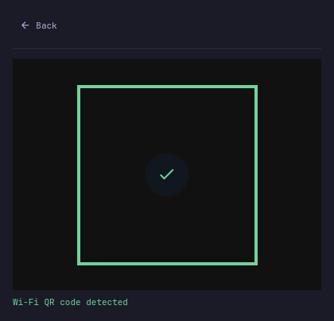

# Network

A network widget for the Omarchy Quickshell bar, by **Daniele Galdi** ([dagnele](https://github.com/dagnele)). Based on Omarchy's **Network** plugin, with camera QR joining and a password visibility toggle.



## Features

- **Camera QR joining:** when disconnected from Wi-Fi, choose **Scan QR** in the Wi-Fi networks header. The webcam opens directly in the themed popup.
- **Clear detection feedback:** a valid Wi-Fi QR code turns the scanning square green and shows a checkmark, followed by the network name and **Join**. Other QR codes show an explanation while scanning continues.
- **Explicit connection:** reading a QR code never connects automatically. Choose **Join** to connect or **Back** to stop scanning.
- **Password visibility:** the password entry has an eye toggle, disabled when empty. Passwords start hidden and are hidden again on submission or dismissal.
- Preserves the original network list, connection details, DNS and band controls, QR sharing, and speed-test actions.

The preview uses a simulated detection state with no real camera image or credentials.

## Requirements

This is an **Omarchy Quickshell/Quattro plugin**, not a Waybar module. Tested against Omarchy `4.0.4-1`, Quickshell `0.3.1`, Qt Multimedia `6.11.2`, and NetworkManager `1.58.1` on Arch Linux. Older Omarchy releases without the shell plugin API are unsupported.

Runtime packages on Omarchy/Arch:

```sh
omarchy pkg add python python-gobject libnm zbar qt6-multimedia qt6-multimedia-ffmpeg
```

A working webcam and NetworkManager-managed Wi-Fi adapter are required for QR joining. The retained network features also use Omarchy's bundled network/DNS commands, `nmcli`, and `wl-copy`. The QR-sharing and speed-test actions summon the installed `omarchy.wifiqr` and `omarchy.speedtest` plugins through public shell IPC.

## Install

Once this repository is public:

```sh
omarchy plugin add https://github.com/dagnele/omarchy-network.git
omarchy plugin enable dagnele.network --section right
```

To replace the built-in Network widget, disable `omarchy.network` after your new widget appears:

```sh
omarchy plugin disable omarchy.network
```

If you already use a personal Network clone, disable that clone instead. Keep only one network widget enabled for normal use. Installation does not edit packaged Omarchy files or automatically replace an existing widget.

To try a local checkout before publication:

```sh
mkdir -p ~/.config/omarchy/plugins/dagnele.network
cp manifest.json Panel.qml QrJoin.qml Model.js join-qr.py LICENSE README.md \
  ~/.config/omarchy/plugins/dagnele.network/
omarchy plugin validate ~/.config/omarchy/plugins/dagnele.network
omarchy-shell shell rescanPlugins
omarchy plugin enable dagnele.network --section right
```

## Use

Click the network icon to open the popup. **Scan QR** is visible only while disconnected from Wi-Fi and is disabled when the radio is off. Press **Q** in the popup for the same action.

On your phone, open the Wi-Fi network's sharing QR code. Hold the entire code inside the camera frame. After detection, check the network name and click **Join**. **Scan again** restarts scanning; **Back** or Escape returns to the network list and discards the scanned credentials. Closing the popup stops the camera.

QR support includes WPA/WPA2 Personal, SAE, WEP, open networks, and hidden SSIDs using the standard `WIFI:` payload. Enterprise QR codes are unsupported. A recognized code does not establish that its password is current; NetworkManager checks that when you join. Each successful QR join saves a new NetworkManager profile named `<SSID> (QR)`.

This plugin has its own identity. Shortcuts that target `omarchy.network` do not automatically target Network. Use these commands when configuring your own shortcuts:

```sh
omarchy-shell shell toggle dagnele.network '{}'
omarchy-shell dagnele.network showJoinQr
```

The direct `showJoinQr` call works only while Wi-Fi is on and disconnected, matching the button.

## Update and remove

For a Git-installed copy:

```sh
omarchy plugin update dagnele.network
```

To restore the original widget and remove Network:

```sh
omarchy plugin enable omarchy.network --section right
omarchy plugin remove dagnele.network
```

If you used another personal network widget before, enable that widget instead. Removing the plugin does not delete NetworkManager connections saved when joining networks.

## Data and permissions

The plugin runs with the logged-in user's permissions inside Omarchy's shell. There are no install hooks, remote builds, telemetry, or automatic privilege escalation. Package installation is a separate, explicit step. Network operations use the session's existing NetworkManager/Polkit permissions.

Camera frames are written inside a private temporary directory under `XDG_RUNTIME_DIR`, decoded locally by ZBar, and deleted after decoding. The directory is removed when the worker exits normally or handles cancellation. An uncatchable process kill can leave temporary files until the runtime directory is cleared.

The Python worker holds a scanned password in memory until confirmation, cancellation, or exit. QML receives the network name and security type, not the password. The worker sends credentials to NetworkManager through libnm; credentials do not appear in command arguments or logs. No camera footage is uploaded or recorded as video.

The widget retains the upstream Network plugin's behavior, including its network-status polling and ping/speed-test features. See [UPSTREAM.md](UPSTREAM.md) for provenance.

## Development

Install `qrencode` to generate synthetic QR fixtures used by the tests:

```sh
omarchy pkg add qrencode
./tools/check.sh
```

Checks validate the manifest, parse the QML, and exercise QR parsing, real image decoding, libnm profile construction, credential isolation, and reset behavior. They never connect to a network or start a webcam. Run the lifecycle checks in [docs/RELEASING.md](docs/RELEASING.md) before publishing an update.

Licensed under MIT; see [LICENSE](LICENSE). Omarchy's copyright notice is retained.
